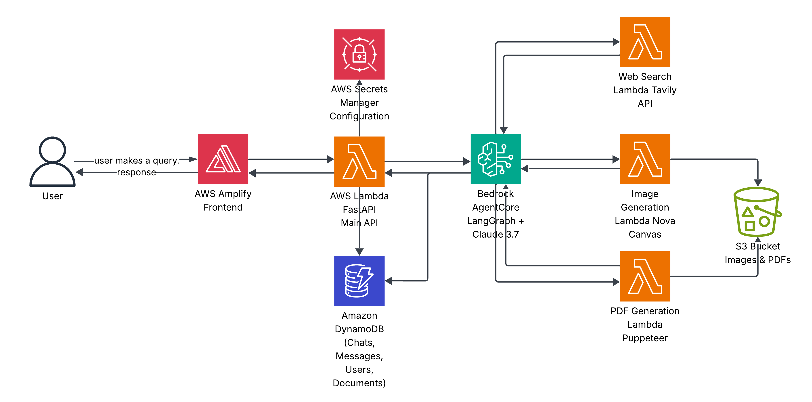

# Deep Market Analyzer 🚀

An AI-powered competitive intelligence platform that helps businesses understand their market position by performing deep competitor analysis and generating actionable insights.

## What It Does

Deep Market Analyzer is an autonomous AI agent that conducts comprehensive competitive analysis between your business and competitors. Just describe your company in a conversation, and the agent will:

- Research market context and industry trends automatically
- Identify and analyze competitors in depth
- Compare products, services, and strategic positioning
- Generate product concept images from your ideas or business descriptions
- Create visual insights and detailed PDF reports
- Provide actionable recommendations based on competitive landscape

Think of it as having a market research team that works 24/7, gathering intelligence and delivering insights in minutes instead of weeks.

## 🌐 Live Demo

Check out the deployed application: **[https://main.d1zc9xcg5a2lei.amplifyapp.com/](https://main.d1zc9xcg5a2lei.amplifyapp.com/)**

## Why It Matters

In today's fast-paced business environment, understanding your competition isn't optional—it's survival. This tool helps you:

- **Make informed decisions** about product development and market strategy
- **Identify gaps** in your offerings compared to competitors
- **Discover opportunities** others might be missing
- **Stay ahead** by monitoring competitive movements and trends
- **Save time and resources** on manual market research

Whether you're a startup validating product-market fit or an established company planning your next move, having clear competitive intelligence is crucial for success.

## Tech Stack

- **Frontend**: Next.js 14, React, TypeScript, Tailwind CSS
- **Backend**: FastAPI (Python), AWS Lambda (Serverless)
- **AI Agent**: LangGraph + **AWS Bedrock Agent Core**
- **AI Models**:
  - **Claude 3.7 Sonnet** (Main reasoning & analysis)
  - **Amazon Nova Canvas** (Image generation)
  - **Amazon Nova Pro** (Image prompt enhancement)
- **Microservices**:
  - **lambda_api**: FastAPI + Mangum (API routing & orchestration)
  - **lambda_img_gen**: Bedrock Runtime + Nova Canvas (Product visualization)
  - **lambda_pdf_gen**: Puppeteer + Chromium + Handlebars (PDF compilation)
  - **lambda_tavily**: Tavily API (Web search & extraction)
  - **agent_core**: LangGraph + Bedrock Agent Core (Agent orchestration)
- **Storage**: DynamoDB (conversations & documents), S3 (file storage with presigned URLs)
- **Deployment**: AWS Lambda, API Gateway, Amplify

## Project Structure

```
deep-market-analyzer/
│
├── backend/
│   ├── agent_core/              # Main AI agent logic
│   │   ├── deep_market_agent.py # LangGraph agent implementation
│   │   ├── prompts.py           # Agent system prompts
│   │   ├── dynamo_handler.py    # DynamoDB interactions
│   │   └── tools/               # Agent tools
│   │       ├── web_search.py    # Tavily integration
│   │       ├── gen_img.py       # Image generation
│   │       └── gen_pdf.py       # PDF report generation
│   │
│   ├── lambda_api/              # Main API Gateway
│   │   ├── main.py              # FastAPI application
│   │   └── app/
│   │       ├── routes.py        # API endpoints
│   │       ├── models.py        # Data models
│   │       └── dynamo.py        # Database operations
│   │
│   ├── lambda_tavily/           # Web search microservice
│   ├── lambda_img_gen/          # Image generation microservice
│   ├── lambda_pdf_gen/          # PDF generation microservice
│   └── utils/                   # Shared utilities
│
└── frontend/
    ├── app/                     # Next.js pages
    │   ├── page.tsx             # Main chat interface
    │   ├── history/             # Analysis history view
    │   └── debug/               # API testing tools
    │
    ├── components/
    │   ├── chat-interface.tsx   # Main chat UI
    │   ├── history-view.tsx     # Document history
    │   ├── markdown-renderer.tsx # Message formatting
    │   └── ui/                  # Reusable UI components
    │
    └── lib/
        ├── api-client.ts        # API communication
        └── services/            # Business logic
```

## How It Works

### Architecture Diagram



### User Journey

1. **Start a conversation**: Tell the agent about your company
2. **Agent researches**: Automatically gathers market context and trends
3. **Choose competitor**: Specify who to analyze or let the agent suggest options
4. **Deep dive**: Agent investigates competitor products, services, and positioning
5. **Get insights**: Receive analysis with generated visuals
6. **Export report**: Download comprehensive PDF with findings

### Agent Architecture

The core is a LangGraph agent running on AWS Bedrock with Claude 3.7 Sonnet. It has access to specialized tools:

- **`research_web`**: Searches the web for recent information
- **`extract_urls`**: Pulls detailed content from specific sources
- **`generate_images`**: Creates visual concepts for products/services
- **`generate_pdf_report`**: Compiles analysis into formatted documents
- **`search_chat_history`**: Retrieves context from previous conversations

The agent maintains conversation state using AWS Agent Core memory, allowing it to remember your company details across sessions and provide personalized insights.

## Key Features

- **Chat-based Interface**: Natural conversation flow for providing information
- **Autonomous Research**: Agent decides what information to gather
- **Product Concept Visualization**: Generate realistic images of your product ideas, new concepts, or business offerings using Amazon Nova Canvas
- **Professional Reports**: Export findings to well-formatted PDFs with embedded images
- **Session History**: Access previous analyses and documents
- **Real-time Streaming**: See the agent's thinking process as it works
- **Persistent Memory**: Agent remembers your company details across sessions via Agent Core

## Getting Started

Each service has its own setup, installation, and deployment instructions. Check the respective folders for detailed documentation:

- **Frontend** (`/frontend`): Next.js app setup and deployment
- **Agent Core** (`/backend/agent_core`): AI agent configuration and deployment
- **API Lambda** (`/backend/lambda_api`): FastAPI service setup
- **Image Generation** (`/backend/lambda_img_gen`): Image service deployment
- **PDF Generation** (`/backend/lambda_pdf_gen`): PDF service deployment
- **Web Search** (`/backend/lambda_tavily`): Tavily integration setup

Each folder contains specific README files and configuration for running locally and deploying to AWS.

## Architecture Notes

- **Serverless**: All backend services run on AWS Lambda for scalability
- **Microservices**: Each tool (search, images, PDF) is an independent service
- **Stateful Agent**: Uses LangGraph checkpointing for conversation continuity
- **Memory Management**: Stores user preferences and past interactions
- **Streaming**: WebSocket-style streaming for real-time responses

## 👥 Ownership

**Authors**: William Ferreira, Luis Adames, Angel Moreno

---

**Developed for AWS Hackathon 2025** 🚀

Built with ❤️ for the AWS Hackathon